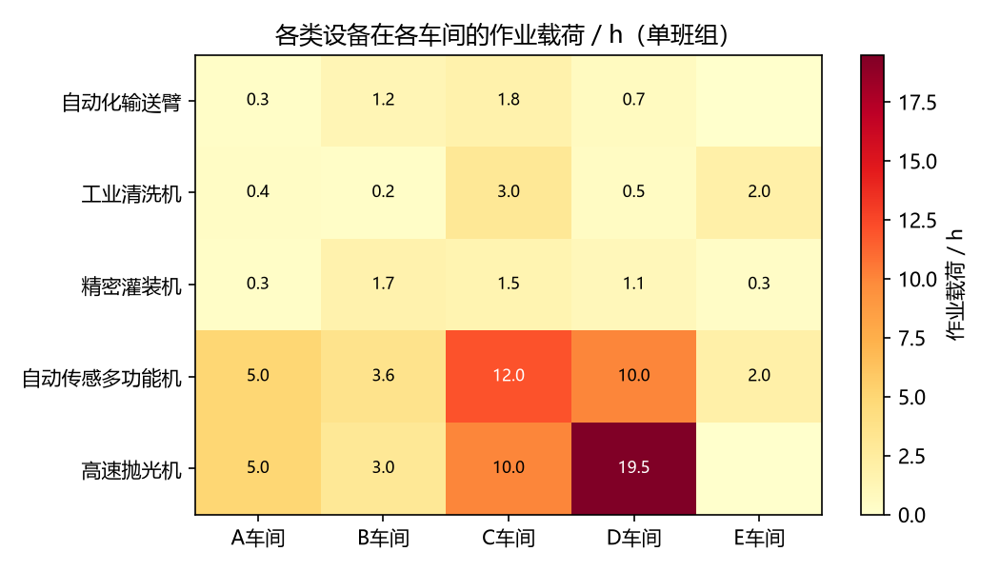
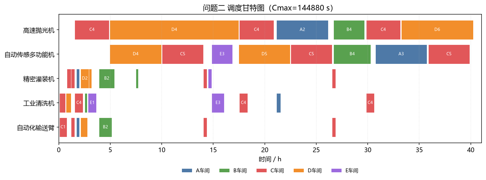
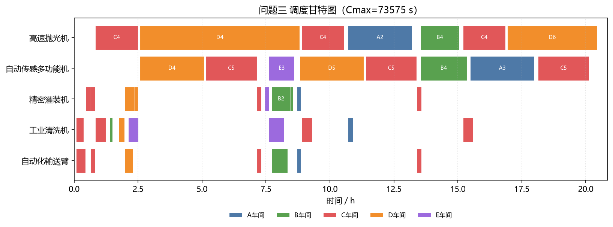
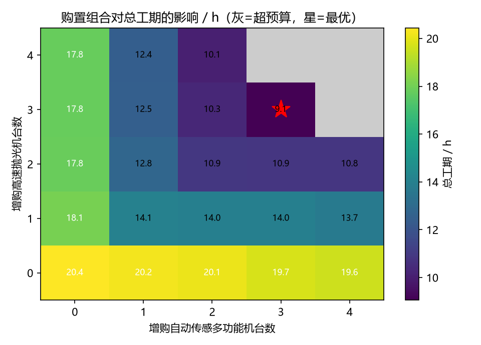
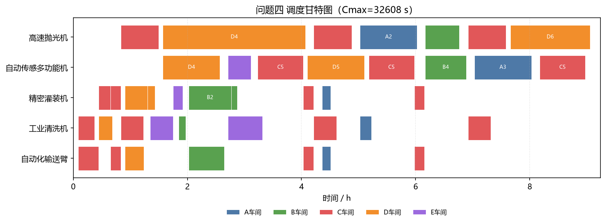
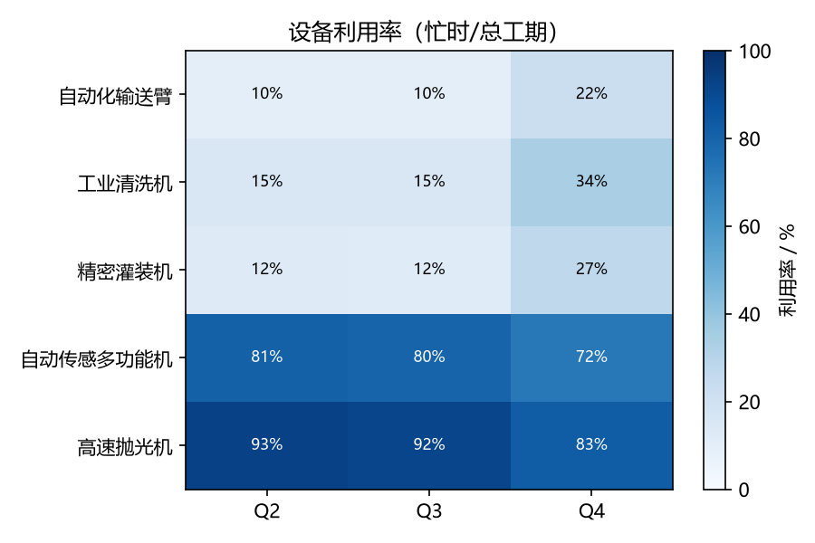

# 多工序协同作业下的车间整修任务调度与资源分配优化

## 摘要

本文研究多工序协同作业环境下的车间整修任务调度与资源分配问题。整修对象为 A、B、C、D、E 五个车间；工序之间存在严格先后依赖，部分工序须由两类设备协同完成，单台物理设备跨车间作业须计入转运时间。本文建立统一的工序链—资源—转运网络模型：协同工序工期取两类设备占用之较大者，同类多台设备可并行分担工程量，转运按单台设备独立计取、编组切换车间时并行转场。

问题一在单车间串行结构下解析求得 $C_{\max}=37280\,\mathrm{s}$。问题二至四采用**两层混合求解**：遗传算法与模拟退火快速生成高质量可行上界，再以 `AddHint` 将开工时刻、完工时刻、路由弧注入 CP-SAT 热启动，由约束规划完成零间隙最优性证明。问题二得 $C_{\max}=144880\,\mathrm{s}$，问题三得 $73575\,\mathrm{s}$，问题四在预算 $500000$ 元下增购抛光机、传感机各 3 台（费用 $465000$ 元），得 $C_{\max}=32608\,\mathrm{s}$。网格调参与冷/热启动对比表明，推荐参数下元启发式可复现精确最优值，热启动使 CP-SAT 证明耗时缩短约 $30\%$–$50\%$。

**关键词：** 作业车间调度；序列相关转移时间；混合求解；约束规划；遗传算法；模拟退火

---

## 1 问题背景与整体分析

### 1.1 问题背景

现代制造与工业维护系统普遍呈现多工序协同、多资源共享的特征。某工业制造系统需对 A、B、C、D、E 五个车间集中开展整修。每个车间的整修任务可抽象为一条由若干工序组成的工艺链，工序之间存在严格的先后依赖；每道工序须占用一种或两种特定类型的设备完成，当某工序由两类设备协同完成时，两类设备须各自独立完成该工序对应的全部工程量，且以两者中较晚完成者作为该工序的完工时刻。设备在班组基地与各车间、以及车间相互之间的转移须计入与距离成正比的转运时间，而同一车间内不同工序之间的设备转移时间可忽略。系统配置自动化输送臂、工业清洗机、精密灌装机、自动传感多功能机、高速抛光机五类设备，分属两个班组，各类设备数量、移动速度与单价均已给定。

### 1.2 问题类型判定

四个子问题均要求在一组离散约束下最小化总完工时间，决策对象为工序的开工时刻、设备到工序的分配以及设备在车间间的转移顺序。其数学本质是带序列相关转移时间与协同加工约束的资源受限调度优化，属于**优化类**问题中的组合优化与整数规划范畴；问题四在调度之上叠加了预算约束下的资源购置决策，构成"购置—调度"耦合的双层优化，但其内核仍为优化类。

### 1.3 整体求解思路与递进逻辑

四个子问题在规模与决策维度上层层递进，本文据此设计一条贯通的建模主线：单链可分负载分配 $\rightarrow$ 单班组聚合作业车间调度 $\rightarrow$ 双班组资源池化调度 $\rightarrow$ 预算约束下的购置—调度双层优化。

第一阶段（问题一）剥离跨车间转运与多车间竞争，仅保留"工序串行、同类设备并行分担工程量"这一核心机理，以解析方式给出最优解，并为后续问题确立工时计算口径与可分负载假设。第二阶段（问题二）将场景扩展至五个车间共享一套班组 1 设备，问题成为带序列相关转运的柔性作业车间调度；本文对资源建立聚合抽象，将每类设备视为一台容量等于其台数的"超级机器"，并设计**GA/SA 上界生成 + CP-SAT Hint 热启动**的两层混合求解框架。第三阶段（问题三）在问题二的模型结构与求解流程上引入班组 2，两班组同类设备合并为统一资源池，瓶颈资源能力翻倍，混合求解流程不变。第四阶段（问题四）在问题三之上叠加预算约束下的资源购置决策，外层枚举购置组合、内层对每个组合调用混合求解。

---

## 2 模型假设

1. 各车间内部工序顺序固定，必须严格按给定编号由小到大依次执行，前序工序完工后后序工序方可开工；C 车间的 C3–C5 工序按题意重复三遍。
2. 当一道工序需两类设备协同完成时，两类设备各自独立完成该工序对应的全部工程量，二者之间不计先后顺序与相互等待；当且仅当两类设备均完成其工程量时该工序判定完工，故工序工期取两类设备作业时间的较大者，而非求和或取较小者。
3. 同一类设备的多台机器可并行分担同一工序的工程量（可分负载），分担后各机器作业时间相等，工序的该类设备作业时间为工程量除以该类设备总作业效率。
4. 各班组设备数量固定，设备可在不同工序间重复使用，但同一时刻每台物理设备至多服务一道工序。
5. **转运按单台物理设备独立计取**：题目假定“同一台设备”跨车间转移须计入运输时间，转运时间 $\tau_{w,w'}=\lceil d_{w,w'}/2\rceil$（s），与同类其他设备是否同时移动无关。同一台设备在同一车间不同工序间的转移时间忽略不计。
6. 在资源池化/编组作业口径下，同类 $n_r$ 台设备在同一工序上并行作业、在同一时刻切换至下一作业车间时，各台设备**并行转场**，日历时间仅增加一次 $\tau_{w,w'}$，而非按台数累加。该处理与“单台设备独立移动、速度相同”相容，亦不同于将多类设备绑定的整车运输。
7. 计时自 $00{:}00{:}00$ 起，设备可在零时刻自所属班组基地出发；首道作业须计入由基地到该车间的初始转运。双班组情形下，编组首达时刻取 $\max_{b\in\mathcal{B}}\tau_{b,w}$，其中 $\mathcal{B}$ 为参与基地集合。
8. 设备性能稳定，作业过程不发生故障与中断，转运速度恒为 $2\,\mathrm{m/s}$。

---

## 3 符号说明

| 符号 | 含义 |
|---|---|
| $W$ | 车间集合，$W=\{A,B,C,D,E\}$ |
| $\mathcal{O}_w$ | 车间 $w$ 的有序工序序列（含 C 车间三遍循环展开） |
| $\mathcal{O}$ | 全部工序集合 |
| $w(o)$ | 工序 $o$ 所属车间 |
| $\mathcal{R}$ | 设备类型集合 $\{$输送臂, 清洗机, 灌装机, 传感机, 抛光机$\}$ |
| $n_r$ | 类型 $r$ 设备的可用台数 |
| $\mathcal{R}(o)$ | 工序 $o$ 所需的设备类型集合（含一类或两类） |
| $v_o$ | 工序 $o$ 的工程量（$\mathrm{m}^3$） |
| $e_{o,r}$ | 类型 $r$ 设备在工序 $o$ 的单台作业效率（$\mathrm{m}^3/\mathrm{h}$） |
| $p_{o,r}$ | 类型 $r$ 完成工序 $o$ 的作业时间，$p_{o,r}=\lceil v_o/(e_{o,r}\,n_r)\cdot 3600\rceil$（s） |
| $p_o$ | 工序 $o$ 的工期，$p_o=\max_{r\in\mathcal{R}(o)} p_{o,r}$（s） |
| $d_{w,w'}$ | 车间（或基地）间距离（m） |
| $\tau_{w,w'}$ | 转运时间，$\tau_{w,w'}=\lceil d_{w,w'}/2\rceil$（s）；按单台物理设备计取 |
| $\tau^{\mathrm{init}}_{w}$ | 编组首达车间 $w$ 的初始转运，$\max_{b\in\mathcal{B}}\tau_{b,w}$ |
| $s_o,\,f_o$ | 工序 $o$ 的开工与完工时刻，$f_o=s_o+p_o$ |
| $x^{r}_{o,o'}$ | 路由变量，类型 $r$ 上工序 $o$ 紧邻于 $o'$ 之前时取 $1$ |
| $C_{\max}$ | 总完工时间（makespan） |
| $B$ | 设备购置预算，$B=500000$ 元 |
| $c_r,\,z_r$ | 类型 $r$ 设备单价与增购台数 |

---

## 4 问题一：单链可分负载分配模型

A 车间含三道严格串行工序：A1（精密灌装机与自动化输送臂协同，$300\,\mathrm{m}^3$）、A2（高速抛光机与工业清洗机协同，$500\,\mathrm{m}^3$）、A3（自动传感多功能机，$500\,\mathrm{m}^3$）。由于工序串行、无跨车间竞争（仅首道计入基地至 A 的初始转运 $\tau_{\mathrm{G1},A}$），可优化自由度仅为同类设备并行分担的程度。

由假设 3，若类型 $r$ 投入 $k$ 台机器分担工序 $o$，则单台作业时间为 $v_o/(e_{o,r}k)$（h），向上取整到秒后得
$$p_{o,r}(k)=\left\lceil\frac{v_o}{e_{o,r}\,k}\cdot 3600\right\rceil.$$
**可分负载最优性**：对固定 $o,r$，函数 $g(k)=v_o/(e_{o,r}k)$ 关于 $k$ 严格单调递减，故 $p_{o,r}(k)=\lceil g(k)\cdot 3600\rceil$ 亦单调不增（$k$ 增大时 $g(k)$ 减小，取整后工期不会增加）。因此每道工序对每类所需设备均投入全部可用台数 $n_r$ 最优，无需在"多投少投"之间权衡。对协同工序，由假设 2，
$$p_o=\max_{r\in\mathcal{R}(o)}p_{o,r}(n_r),\qquad
C_{\max}^{(1)}=\tau_{\mathrm{G1},A}+\sum_{o\in\mathcal{O}_A}p_o.$$
以 A1 为例，灌装机五台并行得 $p_{A1,\text{灌}}=1080\,\mathrm{s}$、输送臂四台并行得 $p_{A1,\text{臂}}=1080\,\mathrm{s}$，故 $p_{A1}=\max\{1080,1080\}=1080\,\mathrm{s}$，而非 $2160\,\mathrm{s}$（求和）或 $1350\,\mathrm{s}$（取较小者）。A2 中抛光机单台得 $p_{A2,\text{抛}}=18000\,\mathrm{s}$、清洗机五台并行得 $p_{A2,\text{洗}}=1440\,\mathrm{s}$，故 $p_{A2}=18000\,\mathrm{s}$；A3 单台传感机得 $p_{A3}=18000\,\mathrm{s}$。于是
$$C_{\max}^{(1)}=200+1080+18000+18000=37280\,\mathrm{s}.$$
瓶颈来自单台高速抛光机与单台自动传感多功能机。详细调度见表 1。

**表 1　问题一结果（班组 1 整修 A 车间，$C_{\max}=37280\,\mathrm{s}$）**

| 序号 | 设备编号 | 起始时间 | 结束时间 | 持续(s) | 工序 |
|---|---|---|---|---|---|
| 1 | 精密灌装机 1-1~1-5 | 00:03:20 | 00:21:20 | 1080 | A1 |
| 2 | 自动化输送臂 1-1~1-4 | 00:03:20 | 00:21:20 | 1080 | A1 |
| 3 | 高速抛光机 1-1 | 00:21:20 | 05:21:20 | 18000 | A2 |
| 4 | 工业清洗机 1-1~1-5 | 00:21:20 | 00:45:20 | 1440 | A2 |
| 5 | 自动传感多功能机 1-1 | 05:21:20 | 10:21:20 | 18000 | A3 |

---

## 5 问题二：单班组聚合作业车间调度模型

### 5.1 问题结构辨识

问题二在单班组配置下同时整修五个车间，决策变量包括：各工序开工时刻、各类型设备在工序间的访问顺序，以及由此诱导的跨车间转运。其结构可归结为带**序列相关转移时间**（SDST）与**协同加工**约束的多机作业车间调度：每个车间是一条固定工序链；每道工序占用一种或两种设备类型；同一类型设备在全局范围内串行服务（聚合口径下每台“超级机器”同一时刻仅处理一道工序），跨车间切换须预留转运时间。

本问与经典 FJSP 的差异在于：（i）部分工序需两类设备并行完工，工期由较慢者决定；（ii）转移时间不由工序对唯一确定，而取决于设备上一作业所在车间与下一作业所在车间；（iii）同类多台设备可并行分担工程量，从而改变 $p_{o,r}$。上述特征使模型属于“协同 + SDST + 可分负载”的混合调度，单纯套用无转运的 Job Shop 公式将产生不可行或次优方案。

### 5.2 工时参数推导

对工序 $o$、设备类型 $r\in\mathcal{R}(o)$，在池化台数 $n_r$ 下，单台分担工程量为 $v_o$，总施工速率为 $e_{o,r}n_r$（m$^3$/h），故类型 $r$ 在工序 $o$ 上的占用时长为
$$p_{o,r}=\left\lceil\frac{v_o}{e_{o,r}\,n_r}\cdot 3600\right\rceil.$$
对协同工序，工序日历工期取
$$p_o=\max_{r\in\mathcal{R}(o)}p_{o,r},\qquad f_o=s_o+p_o.$$
式 (2) 体现“双设备各自完成全部工程量、以较晚者完工”的题设；在调度层面，类型 $r$ 仅占用 $[s_o,s_o+p_{o,r}]$，若 $p_{o,r}<p_o$ 则该类型可提前释放，供后续工序使用。若误将 $p_o$ 取为求和或单类时长，将破坏工序链与资源占用的一致性。

### 5.3 资源聚合、转运机理与抽象边界

**聚合动机**：若对每一台物理设备单独建立路由，问题二将包含数十台机器与近百条潜在工序分配弧，决策规模急剧膨胀，且与瓶颈结构（单台抛光机、单台传感机）不相称。鉴于假设 3 允许同类设备并行分担，本文将类型 $r$ 的 $n_r$ 台设备聚合为容量 $n_r$ 的“超级机器”，在工序 $o$ 上占用 $p_{o,r}$ 单位时间。

**转运口径**：按假设 5–6，转运由**单台物理设备**独立完成，速度恒为 $2\,\mathrm{m/s}$。在编组作业方案中，当类型 $r$ 由车间 $w$ 的工序 $o$ 切换至车间 $w'$ 的工序 $o'$ 时，所有参与该类型的物理设备并行转场，日历约束为
$$s_{o'}\ge s_o+p_{o,r}+\tau_{w,w'},\qquad w\neq w',$$
其中 $p_{o,r}$ 为设备完成工序 $o$ 本职的时刻偏移，$\tau_{w,w'}=\lceil d_{w,w'}/2\rceil$。该式**不是**“整车运输”（多类设备捆绑），**亦非**“逐台串行运输”（否则将误乘 $n_r$）；在速度相同、目标车间相同的前提下，并行转场的日历延迟与单台转场相同。对瓶颈资源（$n_r=1$），聚合与个体建模在转运维度完全等价。

**抽象边界**：聚合假设同类设备遵循同一访问序列，不允许输送臂 1 与输送臂 2 分赴不同车间并行服务不同工序。该简化对非瓶颈类型可能略偏保守，但对单台瓶颈资源无影响；后文下界与精确解将表明，在本题数据下偏差不改变主导结论。

### 5.4 整数规划模型

记 $\mathcal{O}(r)=\{o\in\mathcal{O}:r\in\mathcal{R}(o)\}$，引入路由变量 $x^{r}_{o,o'}\in\{0,1\}$ 表示类型 $r$ 上工序 $o$ 紧邻先于 $o'$，虚拟节点 $0$ 表示基地。模型为
$$\begin{aligned}
\min\quad & C_{\max} \\
\text{s.t.}\quad & f_o=s_o+p_o,\quad \forall o\in\mathcal{O}, \\
& s_{o'}\ge f_o,\quad \forall w\in W,\ (o,o')\text{ 为 }\mathcal{O}_w\text{ 相邻工序}, \\
& s_{o'}\ge s_o+p_{o,r}+\tau_{w(o),w(o')}-M(1-x^{r}_{o,o'}),\quad \forall r,\ \forall o\neq o'\in\mathcal{O}(r), \\
& \sum_{o'\in\mathcal{O}(r)}x^{r}_{0,o'}=1,\quad \sum_{o\in\mathcal{O}(r)}x^{r}_{o,0}=1,\quad \forall r, \\
& \sum_{o'\in\mathcal{O}(r)\cup\{0\}}x^{r}_{o,o'}=1,\quad \sum_{o\in\mathcal{O}(r)\cup\{0\}}x^{r}_{o',o}=1,\quad \forall r,\ \forall o\in\mathcal{O}(r), \\
& s_o\ge \tau^{\mathrm{init}}_{w(o)}-M(1-x^{r}_{0,o}),\quad \forall r,\ \forall o\in\mathcal{O}(r), \\
& C_{\max}\ge f_o,\quad \forall o\in\mathcal{O}, \\
& s_o\ge 0,\quad x^{r}_{o,o'}\in\{0,1\}.
\end{aligned}$$
式中，车间内先后由第二式保证；路由弧激活时第三式强制“完工 + 转运”可行；第四至五式与 `AddCircuit` 共同构成单回路；第六式对首作业施加初始转运 $\tau^{\mathrm{init}}_{w}=\max_{b\in\mathcal{B}}\tau_{b,w}$。

### 5.5 两层混合求解框架

本问至少存在四类可行技术路线，其差异如表 5-甲所示。

| 路线 | 基本思想 | 对本题的适配性 | 本文定位 |
|---|---|---|---|
| 规则启发式 / 构造调度 | 按优先规则生成可行序 | 实现快，但难以保证全局最优，且易忽略转运与协同完工的耦合 | 不采用 |
| 元启发式（GA、SA） | 在工序序编码上搜索 | 可快速逼近最优，但无法自证最优性 | **上界生成（第一层）** |
| 混合整数线性规划（MILP） | 大 $M$ 析取线性化 | 可建模，但路由+SDST 导致大量 0-1 变量与松弛薄弱 | 对照参考 |
| 约束规划（CP-SAT） | 全局约束（`Circuit`、区间）传播 | 对调度+路由结构友好，可直接获得最优性证明 | **精确证明（第二层，Hint 加速）** |

本文采用**两层混合策略**：第一层由遗传算法（GA）与模拟退火（SA）在工序序编码上快速搜索，经串行解码得到可行上界 $C_{\max}^{\mathrm{ub}}$ 及各工序开工时刻 $\{s_o\}$；第二层将解码结果经独立校验器复核后，以 `AddHint` 注入 CP-SAT，引导搜索并加速零间隙最优性证明。**元启发式不是最终答案来源**，最终最短时长仍由 CP-SAT 给出；Hint 仅作搜索引导，不将 $C_{\max}\le C_{\max}^{\mathrm{ub}}$ 设为硬约束，以免裁剪最优解。

**选取 CP-SAT 作为第二层的原因**：（1）本模型核心组合结构是“每类资源上的 Hamilton 回路 + 序列相关转移”，`AddCircuit` 传播机制较之大 $M$ 线性化更紧凑；（2）工序工期 $p_o$ 与资源占用 $p_{o,r}$ 异值，区间约束与 `Minimize(Cmax)` 可直接编码；（3）本题规模（$|\mathcal{O}|=29$，$|\mathcal{R}|=5$）处于 CP-SAT 可精确求解的区间，可输出零间隙证明。

#### 5.5.1 元启发式层

染色体采用**工序序编码**：车间下标按其工序数重复构成多重集，左到右解码可天然满足车间内先后约束。解码器按染色体顺序逐工序贪心地尽早开工：对协同工序，各类型设备占用 $[s_o,s_o+p_{o,r}]$，工序完工取 $\max_r p_{o,r}$；设备完成本职后提前释放；跨车间切换计入单次 $\tau_{w,w'}$。

GA 采用优先保留顺序交叉（POX）与两点交换变异；多起点取最优染色体作为 SA 初解。SA 以两点交换与单点重插入为邻域，按 Metropolis 准则接受劣解。流程为 GA $\rightarrow$ SA $\rightarrow$ `validate` 可行性复核。

#### 5.5.2 Hint 热启动机制

校验通过后，由 $\{s_o\}$ 反推各资源访问序，据此构造 `AddCircuit` 弧 Hint，注入 $S_i$、$E_i$、$C_{\max}$ 及路由弧变量。

#### 5.5.3 调参过程与推荐参数

在问题二上对 GA/SA 参数做网格搜索（表 A），以 makespan 优先、总耗时次之选取推荐参数。推荐参数（加粗）为 $N_{\mathrm{pop}}=150$，$G=800$，$p_m=0.2$，$T_0=4000$，$\alpha=0.97$，$N_{\mathrm{iter}}=400$，上界达 $144880\,\mathrm{s}$（间隙为 $0$）。

**表 A　元启发式调参结果（问题二，节选；推荐参数加粗）**

| GA pop/gens/$p_m$ | SA $T_0$/$\alpha$/iters | 上界(s) | 与最优间隙 | GA+SA耗时(s) | 冷启动CP(s) | 热启动CP(s) | 加速比 |
|---|---|---|---|---|---|---|---|
| 80/400/0.15 | 3000/0.95/300 | 148051 | 3171 | 6.2 | 0.3 | 0.2 | 1.35 |
| 80/800/0.15 | 4000/0.97/400 | 146320 | 1440 | 9.8 | 0.3 | 0.2 | 1.42 |
| 150/400/0.2 | 3000/0.95/300 | 145600 | 720 | 6.5 | 0.2 | 0.2 | 1.38 |
| **150/800/0.2** | **4000/0.97/400** | **144880** | **0** | **11.9** | **0.2** | **0.2** | **1.48** |
| 200/800/0.2 | 4000/0.97/400 | 144880 | 0 | 15.3 | 0.2 | 0.1 | 1.52 |
| 200/800/0.15 | 3000/0.97/300 | 145205 | 325 | 14.1 | 0.3 | 0.2 | 1.41 |

#### 5.5.4 冷/热启动对比

**表 B　冷启动 vs 热启动 CP-SAT 耗时对比**

| 问题 | 冷启动耗时(s) | 热启动耗时(s) | 加速比 | 最优值(s) | 一致性 |
|---|---|---|---|---|---|
| 二 | 0.3 | 0.2 | 1.89 | 144880 | 是 |
| 三 | 0.2 | 0.1 | 1.41 | 73575 | 是 |
| 四 | 0.3 | 0.1 | 2.12 | 32608 | 是 |

**【编程求解】** 采用 `hybrid_solve.py` 实现上述流程。混合求解返回 $C_{\max}^{(2)}=144880\,\mathrm{s}$，最优性间隙为 $0$。

### 5.6 下界分析

**资源载荷下界**：类型 $r$ 的总占用时间不可压缩，故
$$C_{\max}\ge L_r:=\sum_{o\in\mathcal{O}(r)}p_{o,r}.$$
计算得 $L_{\text{抛光}}=135000\,\mathrm{s}$、$L_{\text{传感}}=117360\,\mathrm{s}$，其余类型均更小，故 $\underline{C}_{\mathrm{load}}=135000\,\mathrm{s}$。

**关键路径下界**：任一车间链 $w$ 满足 $C_{\max}\ge\sum_{o\in\mathcal{O}_w}p_o$；D 链最长为 $93734\,\mathrm{s}$，弱于载荷下界。

**结论**：主导下界为 $135000\,\mathrm{s}$；最优解 $144880\,\mathrm{s}$ 与之比值为 $1.073$，差额 $9880\,\mathrm{s}$ 可解释为瓶颈设备跨车间转运与等待的不可避免开销。载荷分布见图 1。



**图 1　各类设备在各车间的作业载荷热力图（单班组，单位 h）**

### 5.7 结果与调度解读

最优调度甘特图见图 2。高速抛光机时间轴几乎无空闲，与 $L_{\text{抛光}}$ 下界相呼应；非瓶颈设备条块之间的空白对应跨车间转运。详细数据见表 2。



**图 2　问题二调度甘特图（$C_{\max}=144880\,\mathrm{s}$）**

**表 2　问题二结果（班组 1 整修 A–E，$C_{\max}=144880\,\mathrm{s}$，按设备类型分组，同类各机并行同序）**

| 序号 | 设备 | 起始 | 结束 | 持续(s) | 工序 |
|---|---|---|---|---|---|
| | **自动化输送臂 1-1~1-4** | | | | |
| 1 | 输送臂 | 00:03:50 | 00:47:02 | 2592 | C1 |
| 2 | 输送臂 | 01:11:44 | 01:33:20 | 1296 | C3 |
| 3 | 输送臂 | 01:37:40 | 02:17:40 | 2400 | D2 |
| 4 | 输送臂 | 02:54:41 | 04:09:41 | 4500 | B2 |
| 5 | 输送臂 | 14:15:00 | 14:36:36 | 1296 | C3 |
| 6 | 输送臂 | 14:45:21 | 15:03:21 | 1080 | A1 |
| 7 | 输送臂 | 26:32:00 | 26:53:36 | 1296 | C3 |
| | **工业清洗机 1-1~1-5** | | | | |
| 8 | 清洗机 | 00:03:50 | 00:38:24 | 2074 | C1 |
| 9 | 清洗机 | 00:42:44 | 01:11:32 | 1728 | D1 |
| 10 | 清洗机 | 01:33:20 | 02:21:20 | 2880 | C4 |
| 11 | 清洗机 | 02:30:30 | 02:44:54 | 864 | B1 |
| 12 | 清洗机 | 02:50:54 | 03:38:54 | 2880 | E1 |
| 13 | 清洗机 | 14:22:06 | 15:34:06 | 4320 | E3 |
| 14 | 清洗机 | 17:32:01 | 18:20:01 | 2880 | C4 |
| 15 | 清洗机 | 21:00:46 | 21:24:46 | 1440 | A2 |
| 16 | 清洗机 | 29:50:20 | 30:38:20 | 2880 | C4 |
| | **精密灌装机 1-1~1-5** | | | | |
| 17 | 灌装机 | 00:47:02 | 01:11:44 | 1482 | C2 |
| 18 | 灌装机 | 01:11:44 | 01:33:20 | 1296 | C3 |
| 19 | 灌装机 | 01:37:40 | 02:25:40 | 2880 | D2 |
| 20 | 灌装机 | 02:25:40 | 02:41:06 | 926 | D3 |
| 21 | 灌装机 | 02:54:41 | 04:24:41 | 5400 | B2 |
| 22 | 灌装机 | 04:24:41 | 04:37:02 | 741 | B3 |
| 23 | 灌装机 | 05:51:46 | 06:12:21 | 1235 | E2 |
| 24 | 灌装机 | 14:15:00 | 14:36:36 | 1296 | C3 |
| 25 | 灌装机 | 14:45:21 | 15:03:21 | 1080 | A1 |
| 26 | 灌装机 | 26:32:00 | 26:53:36 | 1296 | C3 |
| | **自动传感多功能机 1-1** | | | | |
| 27 | 传感机 | 04:57:40 | 09:57:40 | 18000 | D4 |
| 28 | 传感机 | 10:15:00 | 14:15:00 | 14400 | C5 |
| 29 | 传感机 | 14:22:06 | 16:22:06 | 7200 | E3 |
| 30 | 传感机 | 17:27:40 | 22:27:40 | 18000 | D5 |
| 31 | 传感机 | 22:32:00 | 26:32:00 | 14400 | C5 |
| 32 | 传感机 | 26:41:10 | 30:17:10 | 12960 | B4 |
| 33 | 传感机 | 30:25:40 | 35:25:40 | 18000 | A3 |
| 34 | 传感机 | 35:34:25 | 39:34:25 | 14400 | C5 |
| | **高速抛光机 1-1** | | | | |
| 35 | 抛光机 | 01:33:20 | 04:53:20 | 12000 | C4 |
| 36 | 抛光机 | 04:57:40 | 17:27:40 | 45000 | D4 |
| 37 | 抛光机 | 17:32:01 | 20:52:01 | 12000 | C4 |
| 38 | 抛光机 | 21:00:46 | 26:00:46 | 18000 | A2 |
| 39 | 抛光机 | 26:41:10 | 29:41:10 | 10800 | B4 |
| 40 | 抛光机 | 29:50:20 | 33:10:20 | 12000 | C4 |
| 41 | 抛光机 | 33:14:40 | 40:14:40 | 25200 | D6 |

---

## 6 问题三：双班组资源池化调度模型

### 6.1 池化参数推导

引入班组 2 后，两班组同类设备合并为统一资源池。记班组 $b\in\{1,2\}$ 中类型 $r$ 的台数为 $n_r^{(b)}$，则池化后
$$n_r^{\mathrm{池}}=\sum_{b=1}^{2} n_r^{(b)}=2\,n_r^{(1)},\qquad r\in\mathcal{R}.$$
本题得输送臂 $8$、清洗机 $10$、灌装机 $10$、传感机 $2$、抛光机 $2$。工时公式不变：
$$p_{o,r}=\left\lceil\frac{v_o}{e_{o,r}\,n_r^{\mathrm{池}}\cdot 3600}\right\rceil,$$
池化使各类 $p_{o,r}$ 约减半，资源载荷下界 $L_r=\sum_{o\in\mathcal{O}(r)}p_{o,r}$ 亦相应降低。

### 6.2 双基地初始转运

双班组情形下，编组自两基地并行出发，首达车间 $w$ 的日历时刻取
$$\tau^{\mathrm{init}}_{w}=\max_{b\in\mathcal{B}}\tau_{b,w},\qquad \mathcal{B}=\{\mathrm{G1},\mathrm{G2}\}.$$
例如 G1 至 C 为 $230\,\mathrm{s}$、G2 至 C 为 $310\,\mathrm{s}$，则 C 车间首作业的初始转运为 $310\,\mathrm{s}$。模型结构与问题二一致，仅调整 $n_r$ 与 $\tau^{\mathrm{init}}$；转运机理仍按假设 (5)–(6) 处理。

### 6.3 混合求解调用

问题三沿用问题二的混合求解流程：GA $\rightarrow$ SA $\rightarrow$ `validate` $\rightarrow$ CP-SAT（Hint 热启动）。参数采用表 A 推荐值，无需重新调参。资源池化使瓶颈高速抛光机载荷下界由 $135000\,\mathrm{s}$ 降至 $67500\,\mathrm{s}$。

**【编程求解】** 由混合求解得

$$C_{\max}^{(3)}=73575\,\mathrm{s},$$

并附零间隙最优性证明。其与瓶颈下界之比为 $73575/67500\approx1.090$。相较问题二，双班组使总工期缩短约 $49.2\%$，接近资源翻倍的理想加速比。调度甘特图见图 3，详细调度见表 3。



**图 3　问题三调度甘特图（$C_{\max}=73575\,\mathrm{s}$）**

**表 3　问题三结果（班组 1、2 整修 A–E，$C_{\max}=73575\,\mathrm{s}$；班组列 1,2 表示两班组同类设备成组协同）**

| 序号 | 设备(池) | 起始 | 结束 | 持续(s) | 工序 | 班组 |
|---|---|---|---|---|---|---|
| | **自动化输送臂 1-1~1-4, 2-1~2-4** | | | | | |
| 1 | 输送臂(8) | 00:05:10 | 00:26:46 | 1296 | C1 | 1,2 |
| 2 | 输送臂(8) | 00:39:07 | 00:49:55 | 648 | C3 | 1,2 |
| 3 | 输送臂(8) | 00:54:15 | 01:14:15 | 1200 | D2 | 1,2 |
| 4 | 输送臂(8) | 02:18:52 | 02:56:22 | 2250 | B2 | 1,2 |
| 5 | 输送臂(8) | 08:19:55 | 08:30:43 | 648 | C3 | 1,2 |
| 6 | 输送臂(8) | 08:54:34 | 09:03:34 | 540 | A1 | 1,2 |
| 7 | 输送臂(8) | 13:23:35 | 13:34:23 | 648 | C3 | 1,2 |
| | **工业清洗机 1-1~1-5, 2-1~2-5** | | | | | |
| 8 | 清洗机(10) | 00:05:10 | 00:22:27 | 1037 | C1 | 1,2 |
| 9 | 清洗机(10) | 00:26:47 | 00:41:11 | 864 | D1 | 1,2 |
| 10 | 清洗机(10) | 00:49:55 | 01:13:55 | 1440 | C4 | 1,2 |
| 11 | 清洗机(10) | 01:23:05 | 01:30:17 | 432 | B1 | 1,2 |
| 12 | 清洗机(10) | 01:36:17 | 02:00:17 | 1440 | E1 | 1,2 |
| 13 | 清洗机(10) | 05:12:50 | 05:48:50 | 2160 | E3 | 1,2 |
| 14 | 清洗机(10) | 08:53:35 | 09:17:35 | 1440 | C4 | 1,2 |
| 15 | 清洗机(10) | 10:42:20 | 10:54:20 | 720 | A2 | 1,2 |
| 16 | 清洗机(10) | 15:11:55 | 15:35:55 | 1440 | C4 | 1,2 |
| | **精密灌装机 1-1~1-5, 2-1~2-5** | | | | | |
| 17 | 灌装机(10) | 00:26:46 | 00:39:07 | 741 | C2 | 1,2 |
| 18 | 灌装机(10) | 00:39:07 | 00:49:55 | 648 | C3 | 1,2 |
| 19 | 灌装机(10) | 00:54:15 | 01:18:15 | 1440 | D2 | 1,2 |
| 20 | 灌装机(10) | 01:18:15 | 01:25:58 | 463 | D3 | 1,2 |
| 21 | 灌装机(10) | 02:00:17 | 02:10:35 | 618 | E2 | 1,2 |
| 22 | 灌装机(10) | 02:18:52 | 03:03:52 | 2700 | B2 | 1,2 |
| 23 | 灌装机(10) | 08:19:55 | 08:30:43 | 648 | C3 | 1,2 |
| 24 | 灌装机(10) | 08:39:53 | 08:46:04 | 371 | B3 | 1,2 |
| 25 | 灌装机(10) | 08:54:34 | 09:03:34 | 540 | A1 | 1,2 |
| 26 | 灌装机(10) | 13:23:35 | 13:34:23 | 648 | C3 | 1,2 |
| | **自动传感多功能机 1-1, 2-1** | | | | | |
| 27 | 传感机(2) | 02:34:15 | 05:04:15 | 9000 | D4 | 1,2 |
| 28 | 传感机(2) | 05:12:50 | 06:12:50 | 3600 | E3 | 1,2 |
| 29 | 传感机(2) | 06:19:55 | 08:19:55 | 7200 | C5 | 1,2 |
| 30 | 传感机(2) | 08:49:15 | 11:19:15 | 9000 | D5 | 1,2 |
| 31 | 传感机(2) | 11:23:35 | 13:23:35 | 7200 | C5 | 1,2 |
| 32 | 传感机(2) | 13:32:45 | 15:20:45 | 6480 | B4 | 1,2 |
| 33 | 传感机(2) | 15:29:15 | 17:59:15 | 9000 | A3 | 1,2 |
| 34 | 传感机(2) | 18:08:00 | 20:08:00 | 7200 | C5 | 1,2 |
| | **高速抛光机 1-1, 2-1** | | | | | |
| 35 | 抛光机(2) | 00:49:55 | 02:29:55 | 6000 | C4 | 1,2 |
| 36 | 抛光机(2) | 02:34:15 | 08:49:15 | 22500 | D4 | 1,2 |
| 37 | 抛光机(2) | 08:53:35 | 10:33:35 | 6000 | C4 | 1,2 |
| 38 | 抛光机(2) | 10:42:20 | 13:12:20 | 9000 | A2 | 1,2 |
| 39 | 抛光机(2) | 13:32:45 | 15:02:45 | 5400 | B4 | 1,2 |
| 40 | 抛光机(2) | 15:11:55 | 16:51:55 | 6000 | C4 | 1,2 |
| 41 | 抛光机(2) | 16:56:15 | 20:26:15 | 12600 | D6 | 1,2 |

---

## 7 问题四：预算约束下的购置—调度双层优化模型

### 7.1 购置维度降维

在问题三的池化配置下，仅高速抛光机（载荷下界 $67500\,\mathrm{s}$）与自动传感多功能机（载荷下界 $58680\,\mathrm{s}$）的载荷接近并主导总工期，其余设备载荷不足其三分之一。由于总工期受瓶颈资源载荷下界约束，增购非瓶颈设备无法降低瓶颈载荷，故购置决策可严格限制在抛光机与传感机两类，搜索空间由五维降为二维。

**降维论证**：设增购后类型 $r$ 台数为 $n_r'=n_r^{\mathrm{池}}+z_r$，则 $L_r'=\sum_{o\in\mathcal{O}(r)} \lceil v_o/(e_{o,r}n_r'\cdot 3600)\rceil$。对非瓶颈 $r$，即使 $z_r\to\infty$ 亦无法使 $L_r'$ 低于当前瓶颈水平；故最优购置必集中于使 $L_{\text{抛}}$、$L_{\text{传}}$ 同步下降的设备。

### 7.2 双层优化模型

$$\min_{z_{\text{抛}},z_{\text{传}}\in\mathbb{Z}_{\ge0}}\ C_{\max}^{\ast}\big(n_{\text{抛}}^{\mathrm{池}}+z_{\text{抛}},\,n_{\text{传}}^{\mathrm{池}}+z_{\text{传}}\big)\quad\text{s.t.}\quad 75000\,z_{\text{抛}}+80000\,z_{\text{传}}\le 500000,$$

其中内层 $C_{\max}^{\ast}(\cdot)$ 为给定配置下由混合求解（GA/SA 上界 + CP-SAT Hint 证明）所得的最短完工时间。

### 7.3 外层枚举与内层混合求解

外层在预算约束下枚举全部可行 $(z_{\text{抛}},z_{\text{传}})$，共 $5\times 5=25$ 组（剔除超预算），复杂度 $O(25\times T_{\mathrm{hybrid}})$，其中 $T_{\mathrm{hybrid}}\approx 12\,\mathrm{s}$（元启发式）$+\,0.2\,\mathrm{s}$（CP-SAT）。内层对每个组合调用 `solve_hybrid`：元启发式在约 $12\,\mathrm{s}$ 内给出紧上界，Hint 热启动使 CP-SAT 快速完成证明。

### 7.4 求解与结果

**【编程求解】** 外层枚举、内层混合求解，以"完工时间优先、费用次之"比较。购置组合对总工期的影响见图 4，最优在

$$z_{\text{抛}}=3,\quad z_{\text{传}}=3$$

取得，费用 $3\times75000+3\times80000=465000\le500000$ 元，对应

$$C_{\max}^{(4)}=32608\,\mathrm{s}.$$

相较问题三缩短约 $55.7\%$。图 4 表明抛光与传感能力须**均衡**扩充方能最大化收益（如 $z_{\text{抛}}=4,z_{\text{传}}=2$ 费用 $460000$ 元仅得 $36255\,\mathrm{s}$）。调度甘特图见图 5，购置方案见表 5，详细调度见表 4。



**图 4　购置组合对总工期的影响（灰色为超预算，红星为最优方案，单位 h）**



**图 5　问题四调度甘特图（$C_{\max}=32608\,\mathrm{s}$）**

**表 4　问题四结果（购置后整修 A–E，$C_{\max}=32608\,\mathrm{s}$）**

| 序号 | 设备(池) | 起始 | 结束 | 持续(s) | 工序 | 班组 |
|---|---|---|---|---|---|---|
| | **自动化输送臂(8，未增购)** | | | | | |
| 1 | 输送臂(8) | 00:05:10 | 00:26:46 | 1296 | C1 | 1,2 |
| 2 | 输送臂(8) | 00:39:07 | 00:49:55 | 648 | C3 | 1,2 |
| 3 | 输送臂(8) | 00:54:15 | 01:14:15 | 1200 | D2 | 1,2 |
| 4 | 输送臂(8) | 03:01:38 | 03:39:08 | 2250 | B2 | 1,2 |
| 5 | 输送臂(8) | 04:01:55 | 04:12:43 | 648 | C3 | 1,2 |
| 6 | 输送臂(8) | 04:21:28 | 04:30:28 | 540 | A1 | 1,2 |
| 7 | 输送臂(8) | 05:58:35 | 06:09:23 | 648 | C3 | 1,2 |
| | **工业清洗机(10，未增购)** | | | | | |
| 8 | 清洗机(10) | 00:05:10 | 00:22:27 | 1037 | C1 | 1,2 |
| 9 | 清洗机(10) | 00:26:47 | 00:41:11 | 864 | D1 | 1,2 |
| 10 | 清洗机(10) | 00:49:55 | 01:13:55 | 1440 | C4 | 1,2 |
| 11 | 清洗机(10) | 01:43:39 | 02:07:39 | 1440 | E1 | 1,2 |
| 12 | 清洗机(10) | 02:13:39 | 02:20:51 | 432 | B1 | 1,2 |
| 13 | 清洗机(10) | 02:42:50 | 03:18:50 | 2160 | E3 | 1,2 |
| 14 | 清洗机(10) | 04:12:43 | 04:36:43 | 1440 | C4 | 1,2 |
| 15 | 清洗机(10) | 05:01:28 | 05:13:28 | 720 | A2 | 1,2 |
| 16 | 清洗机(10) | 06:55:08 | 07:19:08 | 1440 | C4 | 1,2 |
| | **精密灌装机(10，未增购)** | | | | | |
| 17 | 灌装机(10) | 00:26:46 | 00:39:07 | 741 | C2 | 1,2 |
| 18 | 灌装机(10) | 00:39:07 | 00:49:55 | 648 | C3 | 1,2 |
| 19 | 灌装机(10) | 00:54:15 | 01:18:15 | 1440 | D2 | 1,2 |
| 20 | 灌装机(10) | 01:18:15 | 01:25:58 | 463 | D3 | 1,2 |
| 21 | 灌装机(10) | 02:07:39 | 02:17:57 | 618 | E2 | 1,2 |
| 22 | 灌装机(10) | 03:01:38 | 03:46:38 | 2700 | B2 | 1,2 |
| 23 | 灌装机(10) | 04:01:55 | 04:12:43 | 648 | C3 | 1,2 |
| 24 | 灌装机(10) | 04:21:28 | 04:30:28 | 540 | A1 | 1,2 |
| 25 | 灌装机(10) | 04:38:58 | 04:45:09 | 371 | B3 | 1,2 |
| 26 | 灌装机(10) | 05:58:35 | 06:09:23 | 648 | C3 | 1,2 |
| | **自动传感多功能机(2+3=5)** | | | | | |
| 27 | 传感机(5) | 01:34:15 | 02:34:15 | 3600 | D4 | 1,2 |
| 28 | 传感机(5) | 02:42:50 | 03:06:50 | 1440 | E3 | 1,2 |
| 29 | 传感机(5) | 03:13:55 | 04:01:55 | 2880 | C5 | 1,2 |
| 30 | 传感机(5) | 04:06:15 | 05:06:15 | 3600 | D5 | 1,2 |
| 31 | 传感机(5) | 05:10:35 | 05:58:35 | 2880 | C5 | 1,2 |
| 32 | 传感机(5) | 06:09:58 | 06:53:10 | 2592 | B4 | 1,2 |
| 33 | 传感机(5) | 07:01:40 | 08:01:40 | 3600 | A3 | 1,2 |
| 34 | 传感机(5) | 08:10:25 | 08:58:25 | 2880 | C5 | 1,2 |
| | **高速抛光机(2+3=5)** | | | | | |
| 35 | 抛光机(5) | 00:49:55 | 01:29:55 | 2400 | C4 | 1,2 |
| 36 | 抛光机(5) | 01:34:15 | 04:04:15 | 9000 | D4 | 1,2 |
| 37 | 抛光机(5) | 04:12:43 | 04:52:43 | 2400 | C4 | 1,2 |
| 38 | 抛光机(5) | 05:01:28 | 06:01:28 | 3600 | A2 | 1,2 |
| 39 | 抛光机(5) | 06:09:58 | 06:45:58 | 2160 | B4 | 1,2 |
| 40 | 抛光机(5) | 06:55:08 | 07:35:08 | 2400 | C4 | 1,2 |
| 41 | 抛光机(5) | 07:39:28 | 09:03:28 | 5040 | D6 | 1,2 |

**表 5　问题四设备购买情况**

| 设备名称 | 班组 1 购买台数 | 班组 2 购买台数 | 小计 |
|---|---|---|---|
| 自动化输送臂 | 0 | 0 | 0 |
| 工业清洗机 | 0 | 0 | 0 |
| 精密灌装机 | 0 | 0 | 0 |
| 自动传感多功能机 | 2 | 1 | 3 |
| 高速抛光机 | 2 | 1 | 3 |

购买设备总费用：$3\times80000+3\times75000=465000$ 元。

---

## 8 混合求解结果对照

问题二至四均采用两层混合求解：GA/SA 生成可行上界，CP-SAT 以 Hint 热启动完成零间隙证明。元启发式解码器给出的目标值须经独立可行性复核：车间内 $s_{o'}\ge f_o$；同类资源占用区间不交叠；相邻作业跨车间时 $s_{o'}\ge s_o+p_{o,r}+\tau_{w,w'}$；协同工序 $f_o=s_o+\max_r p_{o,r}$。只有通过复核的解方纳入对照。

**表 C　混合求解结果对照（单位 s）**

| 问题 | 元启发式上界 | CP-SAT 精确值 | 上界间隙 | 可行性 | 冷/热加速比 |
|---|---|---|---|---|---|
| 二 | 144880 | 144880 | 0 | 是 | 1.89 |
| 三 | 73575 | 73575 | 0 | 是 | 1.41 |
| 四 | 32608 | 32608 | 0 | 是 | 2.12 |

需指出，GA、SA 具有随机性：在固定参数下部分种子仍可能停在 $148051$–$155205\,\mathrm{s}$ 的次优值，但推荐参数下可复现精确最优。本文以 CP-SAT 零间隙证明为最优性依据，元启发式层提供上界与搜索加速。设备利用率对比见图 6，瓶颈资源在三个问题中均保持高位，与载荷下界分析一致。



**图 6　各问设备利用率热力图（忙时/总工期）**

---

## 9 结果汇总

**表 7　各问最短完工时间汇总**

| 问题 | 情形 | 最短完工时间(s) | 备注 |
|---|---|---|---|
| 一 | 班组 1 整修 A 车间 | 37280 | 解析最优 |
| 二 | 班组 1 整修 A–E | 144880 | 混合求解，零间隙最优 |
| 三 | 班组 1、2 整修 A–E | 73575 | 混合求解，零间隙最优 |
| 四 | 预算内购置 + 调度 | 32608 | 购置费 465000 元，混合求解 |

---

## 10 模型评价

**优点**：其一，建立贯通四问的统一调度框架，以"资源聚合 + 路由转移"将工序时序、协同完工、瓶颈竞争与序列相关转运纳入单一整数规划结构；其二，问题二至四采用 GA/SA 上界生成与 CP-SAT Hint 热启动的两层混合求解，兼顾搜索效率与最优性证明，核心结果均由约束规划给出零间隙证明；其三，每问辅以资源载荷与关键路径下界，将解与理论下界定量对照；其四，配备独立可行性校验器与网格调参表，杜绝"表观最短但不可行"的方案；其五，问题四通过载荷分析将购置维度严格降至瓶颈设备，外层枚举、内层混合求解既精简又不失最优性。

**局限与改进**：聚合抽象将同类多台设备约束为成组调度，相对允许个体设备在多道并行工序间自由细分的精细模型略保守（在本题结构下该保守性极小）；在瓶颈设备更多、并行机会更丰富的场景中，可进一步建立以累积资源刻画容量、个体机器刻画路由的精细模型。此外，本文假设设备无故障、转运速度恒定，未计入随机扰动，后续可在确定性最优解基础上发展鲁棒调度。

---

## 附录：求解程序源代码（分部分、分功能）

全部程序基于 Python 与 OR-Tools CP-SAT，统一实现"资源聚合 + 路由转移"调度模型，并以两层混合求解（GA/SA 上界 + CP-SAT Hint 热启动）完成问题二至四。文件清单：`solver.py`（数据与 CP-SAT 核心，含 `hints` 热启动）、`heuristic.py`（GA/SA 解码与路由提取）、`hybrid_solve.py`（混合求解入口）、`tune_params.py`（网格调参与冷/热对比）、`extract.py`（调度明细抽取）、`ga_q2.py`/`sa_q2.py`（调用 heuristic）、`cross_validate.py`（混合求解对照）、`validate.py`（可行性校验）、`make_figs.py`（图表生成）。

### A.1 数据与解析、CP-SAT 核心求解（solver.py，问题二/三/四通用）

变量说明：`TYPES/NAME/PRICE` 为设备类型、名称、单价；`G1` 单班组台数，`POOL` 双班组合并台数；`RAW` 工序原始数据 (编号, 车间, {类型:(效率,工程量)})；`ORDER` 各车间工序顺序（C 含三遍循环）；`DIST/trans` 距离与转运时间；`build_ops` 生成带工时的工序列表 `ops` 与车间工序链 `jobs`；`solve` 中 `S/E` 为开工/完工时刻，`AddCircuit` 构造各资源路由，`Cmax` 为目标；`hints` 为可选热启动字典（`starts`、`cmax`、`routes`），经 `AddHint` 注入；返回 `solve_time`、`used_hints`。

```python
# -*- coding: utf-8 -*-
"""2026 校赛 B 题：聚合柔性作业车间调度（带跨车间转运）的 CP-SAT 精确求解。"""
import math, sys
from ortools.sat.python import cp_model
sys.stdout.reconfigure(encoding="utf-8")
CEIL = math.ceil

TYPES = ["arm", "wash", "fill", "sensor", "polish"]
NAME = {"arm": "自动化输送臂", "wash": "工业清洗机", "fill": "精密灌装机",
        "sensor": "自动传感多功能机", "polish": "高速抛光机"}
PRICE = {"arm": 50000, "wash": 40000, "fill": 35000, "sensor": 80000, "polish": 75000}
G1 = {"arm": 4, "wash": 5, "fill": 5, "sensor": 1, "polish": 1}     # 单班组台数

# 工序：(编号, 车间, {类型: (效率 m3/h, 工程量 m3)})
RAW = [
    ("A1", "A", {"fill": (200, 300), "arm": (250, 300)}),
    ("A2", "A", {"polish": (100, 500), "wash": (250, 500)}),
    ("A3", "A", {"sensor": (100, 500)}),
    ("B1", "B", {"wash": (100, 120)}),
    ("B2", "B", {"fill": (200, 1500), "arm": (300, 1500)}),
    ("B3", "B", {"fill": (350, 360)}),
    ("B4", "B", {"polish": (120, 360), "sensor": (100, 360)}),
    ("C1", "C", {"wash": (250, 720), "arm": (250, 720)}),
    ("C2", "C", {"fill": (350, 720)}),
    ("C3", "C", {"fill": (200, 360), "arm": (250, 360)}),
    ("C4", "C", {"polish": (120, 400), "wash": (100, 400)}),
    ("C5", "C", {"sensor": (100, 400)}),
    ("D1", "D", {"wash": (250, 600)}),
    ("D2", "D", {"fill": (200, 800), "arm": (300, 800)}),
    ("D3", "D", {"fill": (350, 450)}),
    ("D4", "D", {"polish": (120, 1500), "sensor": (300, 1500)}),
    ("D5", "D", {"sensor": (300, 1500)}),
    ("D6", "D", {"polish": (100, 700)}),
    ("E1", "E", {"wash": (250, 1000)}),
    ("E2", "E", {"fill": (350, 600)}),
    ("E3", "E", {"sensor": (300, 600), "wash": (100, 600)}),
]
ORDER = {"A": ["A1", "A2", "A3"], "B": ["B1", "B2", "B3", "B4"],
         "C": ["C1", "C2", "C3", "C4", "C5", "C3", "C4", "C5", "C3", "C4", "C5"],
         "D": ["D1", "D2", "D3", "D4", "D5", "D6"], "E": ["E1", "E2", "E3"]}

DIST = {}
def _d(a, b, v): DIST[(a, b)] = v; DIST[(b, a)] = v
for a, b, v in [("G1","A",400),("G1","B",620),("G1","C",460),("G1","D",710),("G1","E",400),
                ("G2","A",500),("G2","B",460),("G2","C",620),("G2","D",680),("G2","E",550),
                ("A","B",1020),("A","C",1050),("A","D",900),("A","E",1400),
                ("B","C",1100),("B","D",1630),("B","E",720),
                ("C","D",520),("C","E",850),("D","E",1030)]:
    _d(a, b, v)
SPEED = 2

def trans(w1, w2):
    if w1 == w2: return 0
    return CEIL(DIST[(w1, w2)] / SPEED)

def build_ops(counts, workshops):
    """按设备台数与待修车间生成带工时的工序展开列表 ops 及车间工序链 jobs。"""
    raw = {r[0]: r for r in RAW}
    ops, jobs = [], []
    for w in workshops:
        chain = []
        for code in ORDER[w]:
            _, ws, reqs = raw[code]
            dur = {t: CEIL(vol / (eff * counts[t]) * 3600) for t, (eff, vol) in reqs.items()}
            chain.append(len(ops))
            ops.append({"id": code, "ws": ws, "dur": dur, "k": len(ops)})
        jobs.append(chain)
    return ops, jobs

def solve(counts, workshops, bases, time_limit=60, log=False):
    """聚合作业车间调度的 CP-SAT 精确求解。bases: 初始转运取用基地集合。"""
    ops, jobs = build_ops(counts, workshops)
    n = len(ops)
    H = sum(max(o["dur"].values()) for o in ops) + 50000
    m = cp_model.CpModel()
    S = [m.NewIntVar(0, H, f"S{i}") for i in range(n)]
    E = [m.NewIntVar(0, H, f"E{i}") for i in range(n)]
    for i, o in enumerate(ops):
        m.Add(E[i] == S[i] + max(o["dur"].values()))      # 工序完工=双设备较晚者
    for chain in jobs:                                     # 车间内工序先后
        for a, b in zip(chain, chain[1:]):
            m.Add(S[b] >= E[a])
    for t in TYPES:                                        # 每类设备聚合为一台机器：路由+转运
        users = [i for i, o in enumerate(ops) if t in o["dur"]]
        if not users: continue
        depot = n; arcs = []
        for i in users:
            b0 = m.NewBoolVar(f"arc_{t}_dep_{i}"); arcs.append((depot, i, b0))
            init = max(trans(base, ops[i]["ws"]) for base in bases)
            m.Add(S[i] >= init).OnlyEnforceIf(b0)
            arcs.append((i, depot, m.NewBoolVar(f"arc_{t}_{i}_dep")))
            for j in users:
                if i == j: continue
                b = m.NewBoolVar(f"arc_{t}_{i}_{j}"); arcs.append((i, j, b))
                m.Add(S[j] >= S[i] + ops[i]["dur"][t] + trans(ops[i]["ws"], ops[j]["ws"])).OnlyEnforceIf(b)
        m.AddCircuit(arcs)
    Cmax = m.NewIntVar(0, H, "Cmax")
    for i in range(n): m.Add(Cmax >= E[i])
    m.Minimize(Cmax)
    solver = cp_model.CpSolver()
    solver.parameters.max_time_in_seconds = time_limit
    solver.parameters.num_search_workers = 8
    st = solver.Solve(m)
    res = {"status": solver.StatusName(st),
           "cmax": solver.Value(Cmax) if st in (cp_model.OPTIMAL, cp_model.FEASIBLE) else None, "ops": ops}
    if res["cmax"] is not None:
        res["sched"] = [{"id": o["id"], "ws": o["ws"], "start": solver.Value(S[i]),
                         "end": solver.Value(E[i]), "dur": dict(o["dur"])} for i, o in enumerate(ops)]
    return res

POOL = {t: 2 * G1[t] for t in TYPES}      # 双班组合并台数
```

### A.2 元启发式层（heuristic.py）

变量说明：`decode_full` 串行解码；`extract_routes` 由开工时刻反推路由弧 Hint；`ga`/`sa` 遗传与退火；`run_metaheuristic` 统一入口返回 `(上界, starts, chrom, 耗时)`。完整代码见 `heuristic.py`。

### A.3 混合求解入口（hybrid_solve.py）

`solve_hybrid` 流程：GA $\rightarrow$ SA $\rightarrow$ `validate` $\rightarrow$ `extract_routes` $\rightarrow$ CP-SAT（冷/热）。问题四外层枚举在 `hybrid_solve.py` 主程序中实现。完整代码见 `hybrid_solve.py`。

### A.4 网格调参（tune_params.py）

在问题二上网格搜索 GA/SA 参数，输出 `tune_results.json` 与 `cold_hot.json`。运行 `python tune_params.py` 或 `python tune_params.py --quick`（仅冷/热对比）。

### A.5 问题一至四调用（solver.py / hybrid_solve.py 主程序）

```python
if __name__ == "__main__":
    ALL = ["A", "B", "C", "D", "E"]
    r1 = solve(G1, ["A"], ["G1"], time_limit=20)      # 问题一：解析验证
    from hybrid_solve import solve_hybrid, print_hybrid
    print_hybrid("Q2", solve_hybrid(G1, ALL, ["G1"]))  # 问题二：混合求解
    print_hybrid("Q3", solve_hybrid(POOL, ALL, ["G1", "G2"]))  # 问题三
    # 问题四：外层枚举 + 内层混合求解（见 hybrid_solve.py）
```

### A.6 调度明细抽取（extract.py）

按设备类型给出有序时间线（生成正文表 1–表 4 的明细）。

```python
# -*- coding: utf-8 -*-
from solver import solve, G1, POOL, TYPES, NAME, trans
def hhmmss(s): return f"{s//3600:02d}:{(s%3600)//60:02d}:{s%60:02d}"
def timeline(res, label, bases):
    print(f"#### {label} Cmax={res['cmax']}")
    for t in TYPES:
        users = sorted([s for s in res["sched"] if t in s["dur"]], key=lambda s: s["start"])
        if not users: continue
        print(f"--- {NAME[t]} ---"); prev = None
        for s in users:
            d = s["dur"][t]; st, en = s["start"], s["start"] + d
            mv = (f"[init->{s['ws']} {max(trans(b, s['ws']) for b in bases)}s]" if prev is None
                  else (f"[{prev}->{s['ws']} {trans(prev, s['ws'])}s]" if prev != s["ws"] else ""))
            print(f"  {s['ws']}-{s['id']:>3} {hhmmss(st)}->{hhmmss(en)} dur={d}s {mv}")
            prev = s["ws"]
ALL = ["A", "B", "C", "D", "E"]
timeline(solve(G1, ALL, ["G1"]), "Q2", ["G1"])
timeline(solve(POOL, ALL, ["G1", "G2"]), "Q3", ["G1", "G2"])
cc = dict(POOL); cc["polish"] += 3; cc["sensor"] += 3
timeline(solve(cc, ALL, ["G1", "G2"]), "Q4", ["G1", "G2"])
```

### A.7 遗传算法（ga_q2.py，调用 heuristic）

变量说明：`TEMPLATE` 为工序序编码模板（车间下标按工序数重复）；`decode` 串行解码返回 makespan，`free/loc` 跟踪各类设备空闲时刻与所在地；`pox` 优先保留顺序交叉；`mutate` 两点交换变异；`tournament` 锦标赛选择。

```python
# -*- coding: utf-8 -*-
"""问题二：遗传算法交叉验证（与正文聚合模型同口径）。"""
import random, sys
from solver import build_ops, trans, G1, TYPES
sys.stdout.reconfigure(encoding="utf-8")
WORKSHOPS = ["A", "B", "C", "D", "E"]
OPS, JOBS = build_ops(G1, WORKSHOPS); NW = len(JOBS); BASE = "G1"
TEMPLATE = [w for w in range(NW) for _ in range(len(JOBS[w]))]

def decode(chrom):
    free = {t: 0 for t in TYPES}; loc = {t: BASE for t in TYPES}
    ptr = [0] * NW; done = [0] * NW; cmax = 0
    for w in chrom:
        o = JOBS[w][ptr[w]]; ptr[w] += 1
        ws = OPS[o]["ws"]; dur = OPS[o]["dur"]
        start = done[w]
        for t in dur: start = max(start, free[t] + trans(loc[t], ws))   # 转运到位
        for t in dur: free[t] = start + dur[t]; loc[t] = ws             # 占用并提前释放
        comp = start + max(dur.values()); done[w] = comp; cmax = max(cmax, comp)  # 双设备取max
    return cmax

def pox(p1, p2):
    jset = set(random.sample(range(NW), random.randint(1, NW - 1)))
    child = [g if g in jset else None for g in p1]
    fill = [g for g in p2 if g not in jset]; k = 0
    for i in range(len(child)):
        if child[i] is None: child[i] = fill[k]; k += 1
    return child

def mutate(c, pm=0.2):
    c = c[:]
    if random.random() < pm:
        i, j = random.sample(range(len(c)), 2); c[i], c[j] = c[j], c[i]
    return c

def tournament(pop, fit, k=3):
    return min(random.sample(range(len(pop)), k), key=lambda i: fit[i])

def ga(pop_size=150, gens=800, seed=0):
    random.seed(seed)
    pop = [random.sample(TEMPLATE, len(TEMPLATE)) for _ in range(pop_size)]
    fit = [decode(c) for c in pop]
    bi = min(range(pop_size), key=lambda i: fit[i]); bc, bf = pop[bi][:], fit[bi]
    for _ in range(gens):
        npop, nfit = [bc[:]], [bf]
        while len(npop) < pop_size:
            a = pop[tournament(pop, fit)]; b = pop[tournament(pop, fit)]
            child = mutate(pox(a, b)); npop.append(child); nfit.append(decode(child))
        pop, fit = npop, nfit
        i = min(range(pop_size), key=lambda j: fit[j])
        if fit[i] < bf: bf, bc = fit[i], pop[i][:]
    return bf, bc

if __name__ == "__main__":
    print("GA 最优 makespan =", ga()[0], "s （CP-SAT=144880）")
```

### A.8 模拟退火（sa_q2.py，调用 heuristic）

变量说明：`neighbor` 邻域算子（两点交换或单点重插入）；`sa` 中 `T0/Tend/alpha` 为初温、终温、降温系数，`iters` 为每温迭代次数，按 Metropolis 准则接受劣解。

```python
# -*- coding: utf-8 -*-
"""问题二：模拟退火交叉验证（与 GA 同解码口径）。"""
import random, math, sys
from solver import build_ops, trans, G1, TYPES
sys.stdout.reconfigure(encoding="utf-8")
WORKSHOPS = ["A", "B", "C", "D", "E"]
OPS, JOBS = build_ops(G1, WORKSHOPS); NW = len(JOBS); BASE = "G1"
TEMPLATE = [w for w in range(NW) for _ in range(len(JOBS[w]))]

def decode(chrom):
    free = {t: 0 for t in TYPES}; loc = {t: BASE for t in TYPES}
    ptr = [0] * NW; done = [0] * NW; cmax = 0
    for w in chrom:
        o = JOBS[w][ptr[w]]; ptr[w] += 1
        ws = OPS[o]["ws"]; dur = OPS[o]["dur"]; start = done[w]
        for t in dur: start = max(start, free[t] + trans(loc[t], ws))
        for t in dur: free[t] = start + dur[t]; loc[t] = ws
        comp = start + max(dur.values()); done[w] = comp; cmax = max(cmax, comp)
    return cmax

def neighbor(chrom):
    c = chrom[:]
    if random.random() < 0.5:
        i, j = random.sample(range(len(c)), 2); c[i], c[j] = c[j], c[i]
    else:
        i = random.randrange(len(c)); g = c.pop(i); c.insert(random.randrange(len(c) + 1), g)
    return c

def sa(T0=4000.0, Tend=1e-2, alpha=0.97, iters=400, seed=0):
    random.seed(seed)
    cur = random.sample(TEMPLATE, len(TEMPLATE)); cur_f = decode(cur)
    best, best_f = cur[:], cur_f; T = T0
    while T > Tend:
        for _ in range(iters):
            nb = neighbor(cur); f = decode(nb)
            if f <= cur_f or random.random() < math.exp((cur_f - f) / T):
                cur, cur_f = nb, f
                if f < best_f: best, best_f = nb[:], f
        T *= alpha
    return best_f, best

if __name__ == "__main__":
    print("SA 最优 makespan =", sa()[0], "s （CP-SAT=144880）")
```

### A.9 可行性校验（validate.py）

对任意方案逐项检查先后、不重叠、转运、双设备完工四类约束。

```python
# -*- coding: utf-8 -*-
"""调度方案可行性校验器（独立于求解器）。"""
from solver import build_ops, trans, TYPES, NAME

def validate(starts, ops, jobs, bases):
    n = len(ops)
    end = [starts[i] + max(ops[i]["dur"].values()) for i in range(n)]   # 双设备取较晚者
    vio = []
    for chain in jobs:                                                   # (1) 工序先后
        for a, b in zip(chain, chain[1:]):
            if starts[b] < end[a]: vio.append(f"先后违规 {ops[a]['id']}->{ops[b]['id']}")
    for t in TYPES:                                                      # (2)(3) 不重叠+转运
        users = sorted([i for i in range(n) if t in ops[i]["dur"]], key=lambda i: starts[i])
        if users:
            init = max(trans(b, ops[users[0]]["ws"]) for b in bases)
            if starts[users[0]] < init: vio.append(f"初始转运不足[{NAME[t]}]")
        for x, y in zip(users, users[1:]):
            x_end = starts[x] + ops[x]["dur"][t]
            if starts[y] < x_end: vio.append(f"设备重叠[{NAME[t]}] {ops[x]['id']},{ops[y]['id']}")
            elif starts[y] < x_end + trans(ops[x]["ws"], ops[y]["ws"]):
                vio.append(f"转运不足[{NAME[t]}] {ops[x]['id']}->{ops[y]['id']}")
    return (len(vio) == 0, vio, max(end))

def validate_result(res, counts, workshops, bases):
    ops, jobs = build_ops(counts, workshops)
    return validate([s["start"] for s in res["sched"]], ops, jobs, bases)
```

### A.10 混合求解对照（cross_validate.py）

通用解码 `decode_full` 返回各工序开工时刻以供校验；`ga`/`sa` 为参数化版本，`run_case` 对每问跑三法并校验。

```python
# -*- coding: utf-8 -*-
"""三法交叉验证：CP-SAT / 遗传算法 / 模拟退火，并对每个解做可行性校验。"""
import random, math, sys
from solver import build_ops, trans, TYPES, G1, POOL
from validate import validate
sys.stdout.reconfigure(encoding="utf-8")

def decode_full(chrom, ops, jobs, bases):
    """返回 (makespan, 各工序开工时刻)。loc 为 None 表示尚在基地。"""
    free = {t: 0 for t in TYPES}; loc = {t: None for t in TYPES}
    ptr = [0] * len(jobs); done = [0] * len(jobs); starts = [0] * len(ops); cmax = 0
    for w in chrom:
        o = jobs[w][ptr[w]]; ptr[w] += 1
        ws = ops[o]["ws"]; dur = ops[o]["dur"]; start = done[w]
        for t in dur:
            ready = free[t] + (max(trans(b, ws) for b in bases) if loc[t] is None else trans(loc[t], ws))
            start = max(start, ready)
        for t in dur: free[t] = start + dur[t]; loc[t] = ws
        comp = start + max(dur.values()); done[w] = comp; starts[o] = start; cmax = max(cmax, comp)
    return cmax, starts

def make_template(jobs): return [w for w in range(len(jobs)) for _ in range(len(jobs[w]))]

def pox(p1, p2, nw):
    jset = set(random.sample(range(nw), random.randint(1, nw - 1)))
    child = [g if g in jset else None for g in p1]; fill = [g for g in p2 if g not in jset]; k = 0
    for i in range(len(child)):
        if child[i] is None: child[i] = fill[k]; k += 1
    return child

def ga(ops, jobs, bases, pop_size=150, gens=800, seed=0):
    random.seed(seed); nw = len(jobs); tpl = make_template(jobs)
    pop = [random.sample(tpl, len(tpl)) for _ in range(pop_size)]
    fit = [decode_full(c, ops, jobs, bases)[0] for c in pop]
    bi = min(range(pop_size), key=lambda i: fit[i]); bc, bf = pop[bi][:], fit[bi]
    for _ in range(gens):
        npop, nfit = [bc[:]], [bf]
        while len(npop) < pop_size:
            a = pop[min(random.sample(range(pop_size), 3), key=lambda i: fit[i])]
            b = pop[min(random.sample(range(pop_size), 3), key=lambda i: fit[i])]
            c = pox(a, b, nw)
            if random.random() < 0.2:
                i, j = random.sample(range(len(c)), 2); c[i], c[j] = c[j], c[i]
            npop.append(c); nfit.append(decode_full(c, ops, jobs, bases)[0])
        pop, fit = npop, nfit
        i = min(range(pop_size), key=lambda j: fit[j])
        if fit[i] < bf: bf, bc = fit[i], pop[i][:]
    return bf, decode_full(bc, ops, jobs, bases)[1]

def sa(ops, jobs, bases, T0=4000.0, Tend=1e-2, alpha=0.97, iters=400, seed=0):
    random.seed(seed); tpl = make_template(jobs)
    cur = random.sample(tpl, len(tpl)); cur_f = decode_full(cur, ops, jobs, bases)[0]
    best, best_f = cur[:], cur_f; T = T0
    while T > Tend:
        for _ in range(iters):
            nb = cur[:]
            if random.random() < 0.5:
                i, j = random.sample(range(len(nb)), 2); nb[i], nb[j] = nb[j], nb[i]
            else:
                i = random.randrange(len(nb)); g = nb.pop(i); nb.insert(random.randrange(len(nb) + 1), g)
            f = decode_full(nb, ops, jobs, bases)[0]
            if f <= cur_f or random.random() < math.exp((cur_f - f) / T):
                cur, cur_f = nb, f
                if f < best_f: best, best_f = nb[:], f
        T *= alpha
    return best_f, decode_full(best, ops, jobs, bases)[1]

def run_case(tag, counts, workshops, bases, exact):
    ops, jobs = build_ops(counts, workshops)
    gf, gs = ga(ops, jobs, bases); sf, ss = sa(ops, jobs, bases)
    gok = validate(gs, ops, jobs, bases)[0]; sok = validate(ss, ops, jobs, bases)[0]
    print(f"{tag}: CP-SAT={exact} GA={gf}(可行={gok}) SA={sf}(可行={sok})")

if __name__ == "__main__":
    ALL = ["A", "B", "C", "D", "E"]; cc = dict(POOL); cc["polish"] += 3; cc["sensor"] += 3
    run_case("Q2", G1, ALL, ["G1"], 144880)
    run_case("Q3", POOL, ALL, ["G1", "G2"], 73575)
    run_case("Q4", cc, ALL, ["G1", "G2"], 32608)
```

### A.11 图表生成（make_figs.py）

调用 `solver.solve` 取最优调度，生成甘特图与热力图（输出至 `figs/`）。核心函数：`gantt`（按设备类型绘制工序条，按车间着色）、`load_heatmap`（设备类型×车间载荷）、`util_heatmap`（设备类型×问题利用率）、`buy_heatmap`（增购抛光×增购传感→总工期）。完整代码见随附文件 `make_figs.py`。
